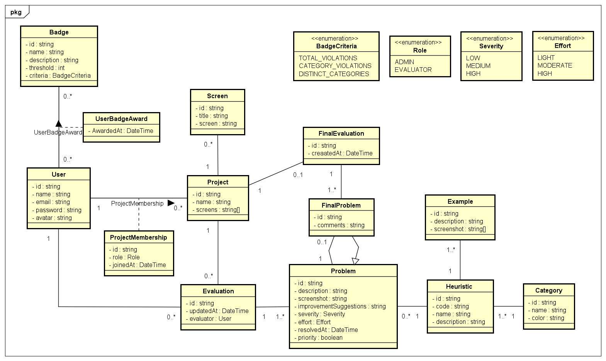

# Diagrama de classes

## Fluxo Geral do Sistema

1. **Criação de Projeto**: um administrador cria um Project, define as telas a avaliar.
2. **Alocação de Avaliadores**: O administrador adiciona os usuários no projeto via ProjectMembership, com papel EVALUATOR.
3. **Execução de Avaliações**: avaliadores e adminstradores realizam Evaluations, apontando Problems em cada tela, classificando-os por heurística, severidade, esforço e etc.
4. **Síntese Final**: consolida-se uma FinalEvaluation, agrupando problemas similares em FinalProblems, com comentários de resumo.
5. **Gamificação**: conforme cada usuário identifica problemas, o sistema contabiliza suas violações e, ao cumprir certos critérios (BadgeCriteria + threshold), atribui Badges (UserBadgeAward).
6. **Documentação e Exemplos**: o repositório de Examples ajuda avaliadores a entender cada heurística por meio de screenshots e descrições.

## Observações

- Um **User** pode pertencer a vários **Project**s, com papéis distintos (ADMIN ou EVALUATOR) e data de entrada registrada.
- Cada **Project** agrupa um conjunto de telas (screens) que serão avalia.
- Um **Evaluator** (usuário com papel apropriado) executa uma **Evaluation** (avaliação) em um projeto, identificando diversos **Problems** (violações de diretrizes de usabilidade).
- Cada **Problem** classifica‑se segundo uma **Heuristic** (e sua **Category**).
- Problemas podem ser marcados como “priority” e se já foram resolvidos, terão uma data de resolução.
- Ao término do ciclo, cada **Project** recebe uma **FinalEvaluation**, que consolida diversos **FinalProblem**s.
- Um **FinalProblem** faz a “união” de um ou mais **Problem**s similares, acrescentando comentários de síntese.
- **Example** fornece provas visuais (screenshots) ilustrando cada heurística em uso.
- **Badge** define metas (por ex. “20 violações identificadas no total” ou “5 categorias distintas avaliadas”) e, quando um **User** atinge o limite mínimo (threshold), recebe um **UserBadgeAward**.
