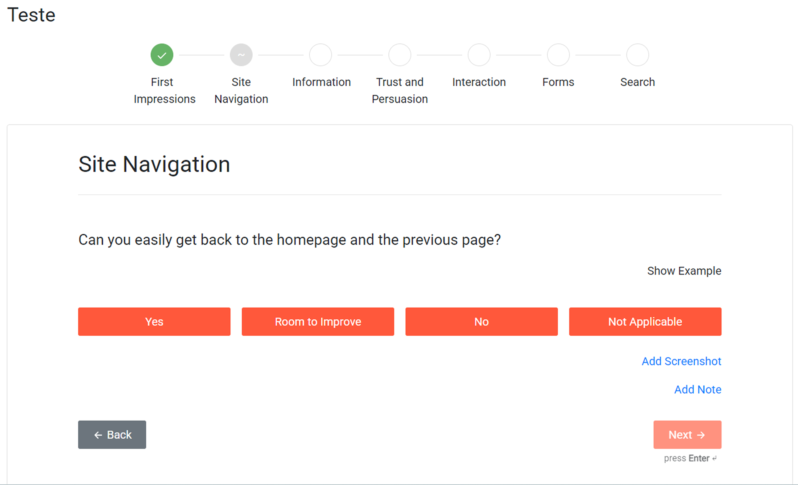
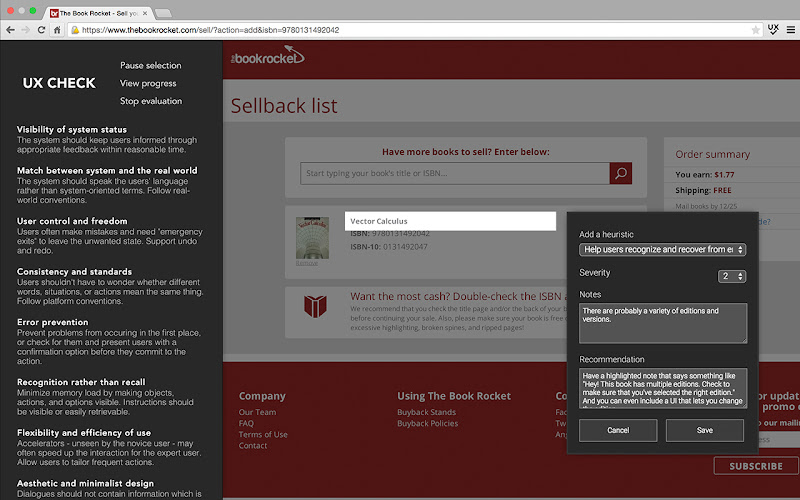

# Documento de Visão

## Histórico de Revisões

| Data       | Versão | Descrição      | Autores                                         |
| ---------- | ------ | -------------- | ----------------------------------------------- |
| 02/12/2024 | 1.0    | Versão Inicial | Radmila Gama |
| 19/12/2024 | 1.1    | Revisão do Escopo e dos Usuários | Radmila Gama |
| 01/02/2025 | 2.0    | Alteração no escopo e na ideia do projeto  | Radmila Gama |
| 28/04/2025 | 2.1    | Adição do método Eureca e das funções educacionais  | Radmila Gama e Ramon Vieira |

---

## Objetivo 
O principal objetivo da aplicação é fornecer uma plataforma onde alunos possam avaliar interfaces gráficas com base nas diretrizes de design, utilizando como base a Lista Eureca, criada e documentada por Silvia Matos, Marília Aranha, Isis Duarte e Ramon Vieira. A aplicação permitirá a criação e o gerenciamento de projetos com foco na avaliação das interfaces gráficas, incentivando a melhoria contínua delas e promovendo a qualidade e sistematização na hora de identificar problemas. Além de ser uma ferramenta para apoio computacional a identificação de problemas, é também idealizada para permitir o registro da proposta de solução para as diretrizes que foram feridas de acordo com a avaliação, além de relatar a gravidade do problema detectado e o esforço para que o mesmo seja resolvido. Com esses dados, a aplicação irá gerar relatório final da avaliação com uso de gráficos e métricas para o avaliador.

---

## Descrição do Problema

**O problema de:**
Falta de uma plataforma específica para avaliar interfaces gráficas com base em heurísticas de usabilidade.

**Afetando:**
Alunos de TADS que precisam identificar e corrigir problemas de design de forma sistemática.

**Cujo impacto é:**
Dificuldade em documentar violações de heurísticas, propor melhorias e priorizar correções de maneira organizada.

**Uma boa solução seria:**
Uma aplicação web que permita a avaliação de projetos, incluindo upload de imagens, classificação de problemas, descrição de melhorias e análise da gravidade e esforço necessário para resolvê-los.

---

## Descrição dos Usuários

| Nome          | Descrição                                                     | Responsabilidade                                                             |
| ------------- | ------------------------------------------------------------- | ---------------------------------------------------------------------------- |
| Avaliador     | Alunos desenvolvedores e designers.                           | Avaliar os projetos com base nas heurísticas, fornecer feedback e sugestões. |
| Administrador | Gestor do sistema                                             | Gerenciar usuários, projetos e configurações do sistema.                     |

---

## Descrição do Ambiente dos Usuários

Os usuários poderão acessar a aplicação por meio de qualquer dispositivo com acesso à internet e um navegador atualizado. O sistema será com foco no desktop, mas, para planos futuros, terá uma versão mobile apenas com as métricas dos projetos.

---

## Principais Necessidades dos Usuários

**Avaliadores:** Precisam de uma ferramenta que permita identificar e documentar violações de heurísticas com facilidade, incluindo o upload de imagens e a descrição de melhorias. Além disso, terão acesso a métricas detalhadas sobre as violações registradas, permitindo uma análise mais precisa e facilitando a priorização e resolução dos problemas identificados. Essas métricas ajudarão a compreender a recorrência das falhas e a eficiência das soluções aplicadas ao longo do tempo.
**Administradores:** Necessitam gerenciar usuários, projetos e manter a integridade das informações cadastradas.

---

## Alternativas Concorrentes

1. [Heurix | A free heuristic evaluation tool]([url](https://www.heurix.io))
Trata-se de uma ferramenta utilizada para avaliar telas por meio de questionários. A avaliação começa imediatamente após o login, quando o usuário é solicitado a criar um projeto. Em seguida, as perguntas são iniciadas, organizadas em diferentes categorias: Primeiras Impressões (First Impressions), Navegação do Site (Site Navigation), Informações (Information), Confiança e Persuasão (Trust and Persuasion), Interação (Interaction), Formulários (Forms) e Pesquisa (Search).

Essa aplicação não segue nenhuma lista de diretrizes ou heurísticas de usabilidade como referência, baseando-se apenas em perguntas objetivas com respostas limitadas a "Yes" (Sim), "Room to Improve" (Tem como melhorar), "No" (Não) e "Not Applicable" (Não se aplica). Isso significa que não há um conjunto estruturado de princípios reconhecidos, como as heurísticas de Nielsen ou as diretrizes da ISO, para fundamentar a avaliação.

A ausência de um referencial teórico claro pode comprometer a profundidade da análise, tornando-a subjetiva e inconsistente. Sem diretrizes bem estabelecidas, os avaliadores podem interpretar os critérios de diferentes formas, levando a conclusões variadas e menos confiáveis. Além disso, uma lista de heurísticas ajudaria a garantir que aspectos essenciais da usabilidade sejam cobertos de maneira sistemática, enquanto um modelo de perguntas objetivas pode deixar lacunas importantes na avaliação. Isso pode resultar em diagnósticos superficiais e recomendações imprecisas para melhorias, reduzindo a eficácia do processo de avaliação.

Outra limitação da aplicação é que o questionário é aplicado ao sistema como um todo, em vez de ser direcionado a casos de uso específicos. Isso significa que as perguntas são formuladas de maneira genérica, avaliando o sistema de forma global, sem considerar fluxos específicos de interação. Como consequência, uma determinada funcionalidade, como a tela inicial, pode atender corretamente aos critérios avaliados, enquanto uma página interna pode apresentar problemas que passam despercebidos. Essa abordagem ampla e pouco detalhada torna a ferramenta ineficiente para a avaliação de interfaces, pois não identifica com precisão os pontos críticos de usabilidade em diferentes partes do sistema.

Apesar dos problemas anteriormente citados, o Heurix permite que o usuário adicione uma imagem e uma nota por cada pergunta. A inserção desses dados contribui para os resultados obtidos pelo avaliador, o que, consequentemente, colabora para a resolução do problema encontrado na interface. Outro ponto positivo encontrado na aplicação é mostrado quando o avaliador termina de responder todas as perguntas e a interface mostra um quadro com a pontuação sobre as perguntas respondidas. 

2. Extensão UX Check

A extensão não funciona mais, porém a página de detalhes dela apresenta fotos e uma descrição de como ela funciona. A extensão possui uma ferramenta para o usuário selecionar a parte da tela que possui erros, a aplicação dá a entender que essa extensão funciona para qualquer website e que essa ferramenta tira um print da tela completa exibida para o usuário quando ele seleciona a parte que possui erros. 

A UX Check utiliza a lista de diretrizes de Nielsen e quando o usuário seleciona a parte com erros, uma janela aparece para que ele selecione qual heurística representa aquele erro. Para complementar a avaliação, o usuário também precisa informar a gravidade do problema, ele pode deixar notas e comentários de recomendações para que o problema seja resolvido.

Por fim, após a avaliação, é possível que o usuário baixe a avaliação como um arquivo do tipo docs.

## Visão Geral do Produto

A aplicação será uma ferramenta web para avaliação de usabilidade com foco em heurísticas. Permitir aos usuários:

- Criar e gerenciar projetos, incluindo nome, descrição e logotipo.
- Adicionar casos de uso ao projeto e selecionar imagens desses casos de uso para avaliação.
- Identificar violações de princípios, identificar a heuristica ferida, selecionar o esforço e propor melhorias.
- Gerar métricas relatórios detalhados com base nas análises realizadas.

---

## Requisitos Funcionais

### Prioridade: 
(Metodologia MoSCoW)

1. Essencial (Obrigatório / Must Have)
Requisitos que devem ser implementados para que o sistema funcione minimamente.
Sem esses requisitos, o sistema perde sua funcionalidade principal.
Exemplo: "O sistema deve permitir que o usuário realize login com email e senha."

2. Importante (Deveria Ter / Should Have)
São requisitos relevantes, mas não são essenciais para a primeira versão do sistema.
Podem ser adiados para versões futuras caso o prazo ou orçamento sejam limitados.
Exemplo: "O sistema deveria permitir login via redes sociais."

3. Desejável (Poderia Ter / Could Have)
Melhorias ou funcionalidades adicionais que trazem valor ao usuário, mas não são críticas.
Sua implementação depende da disponibilidade de tempo e recursos.
Exemplo: "O sistema poderia ter um tema escuro personalizável."

4. Opcional (Não Prioritário / Won't Have for Now)
Funcionalidades que foram sugeridas, mas não serão implementadas nesta versão.
Podem ser consideradas para futuras releases, mas não afetam a entrega atual.
Exemplo: "O sistema não terá suporte para múltiplos idiomas nesta versão."

| Código | Nome                            | Descrição                                                                                                                                                                                                         | Prioridade  |
|--------|---------------------------------|-------------------------------------------------------------------------------------------------------------------------------------------------------------------------------------------------------------------|-------------|
| F01    | Autenticação                    | O sistema deve permitir efetuar login e cadastro de usuários com diferentes permissões (Administrador, Avaliador).                                                                                                | Essencial   |
| F02    | Adicionar Projetos              | O sistema deve permitir criar, editar e excluir projetos, contendo nome, descrição e marca gráfica.                                                                                                               | Essencial   |
| F03    | Adicionar Casos de Uso          | O sistema deve permitir criar, editar e excluir casos de uso, com nome, descrição e fotos que compõem aquele fluxo.                                                                                               | Essencial   |
| F04    | Upload de Imagens               | O sistema deve permitir o upload de imagens para cada caso de uso.                                                                                                                                                | Essencial   |
| F05    | Categorizar Violações           | O sistema deve permitir que o avaliador associe violações encontradas nas imagens às diretrizes da lista de Matos e Freire, categorizando cada violação.                                                          | Essencial   |
| F06    | Estimar o Tempo de Resolução    | O sistema deve permitir que o avaliador estime, em horas e minutos, o tempo necessário para corrigir cada problema identificado.                                                                                  | Essencial   |
| F07    | Avaliação de Esforço            | O sistema deve permitir que o avaliador estime o esforço necessário para corrigir cada problema, auxiliando na priorização de correções.                                                                          | Essencial   |
| F08    | Proposta de Melhoria            | O sistema deve permitir que o avaliador descreva sugestões de melhorias para resolver os problemas identificados.                                                                                                 | Essencial   |
| F09    | Avaliação por Múltiplos Avaliadores         | O sistema deve permitir que de 3 a 5 avaliadores avaliem o mesmo projeto de forma independente.       | Essencial             |
| F10    | Consolidação de Avaliações                  | O sistema deve permitir que os avaliadores, após realizarem suas avaliações individuais, consolidem os resultados em uma única avaliação final do projeto. | Essencial             |
| F11    | Identificação de Erros Comuns               | O sistema deve permitir a identificação automática ou manual dos erros que foram encontrados por mais de um avaliador. | Essencial            |
| F12    | Resumo da Avaliação Consolidada             | O sistema deve gerar um resumo da avaliação final, indicando os erros consensuais, erros únicos e soluções propostas. | Essencial            |
| F13    | Controle de Status da Avaliação             | O sistema deve permitir que um projeto tenha status como: "Em Avaliação Individual", "Em Consolidação" e "Avaliação Consolidada". | Essencial             |
| F14   | Coleta de Métricas do Projeto   | O sistema deveria coletar métricas detalhadas por projeto, como número de vezes que cada categoria aparece, número de vezes que cada diretriz aparece, tempo total para resolver as diretrizes de um projeto e o esforço total para resolvê-las.                                                                                                                                                                                                                                              | Importante  |
| F15    | Coleta de Métricas do Avaliador | O sistema deveria coletar métricas detalhadas do avaliador. Esses dados vêm de todas as avaliações de todos os projetos. Essas métricas incluem uma listagem dos 3 projetos com maior tempo de resolução, número total de horas gastas resolvendo problemas, a categoria mais comum e o número de vezes que ela foi registrada, além da diretriz mais comum e o número de vezes que ela foi registrada.                                                                                        | Importante  |
| F16    | Visualização de Métricas        | O sistema deveria permitir que o avaliador visualize as métricas coletadas, incluindo a classificação das métricas com base na gravidade, no esforço para resolver e na frequência de violação das diretrizes.    | Importante  |
| F17    | Resolver a Diretriz             | O sistema poderia permitir que o avaliador marque a diretriz como resolvida e que ele faça upload de uma foto mostrando a resolução.                                                                              | Desejável   |
| F18    | Seção Educacional               | O sistema deveria oferecer uma seção educativa com materiais sobre princípios de design de interfaces, como paletas de cor, affordance, heurísticas de Nielsen, e boas práticas de usabilidade.                  | Opcional |

---

## Requisitos Não-Funcionais

| Código | Nome                      | Descrição                                                                          | Categoria                    | Classificação |
| ------ | ------------------------- | ---------------------------------------------------------------------------------- | -----------------------------| ------------- |
| NF01   | Segurança dos Dados       | As informações armazenadas devem ser protegidas com autenticação e criptografia.   | Segurança                    | Obrigatório   | 
| NF02   | Tempo de Resposta         | O sistema deve carregar os projetos em menos de 5 segundos.                        | Eficiência e Performance     | Desejável     | 
| NF03   | Ambiente de funcionamento | O sistema deve funcionar nos navegadores mais usados, como Chrome, Firefox e Edge. | Compatibilidade              | Essencial     |

[Requisitos Não Funcionais (Mensuráveis)]([url](https://github.com/radmilags/TCC/tree/main/doc/req_qualidade))
